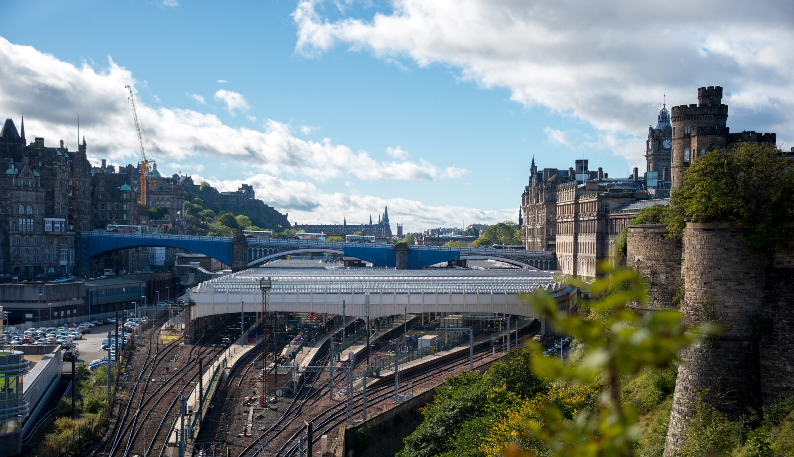

# About

Hello, I’m Patrick, a geographer and urban planner who focuses on transportation and land use. I'm currently a PhD student at [the University of Edinburgh](https://www.ed.ac.uk). My [research](#research) looks at ways to reduce the harm caused by automobiles and ways to improve human and environmental health and wellbeing in cities.

Before starting PhD research, I worked in geography and urban planning in Chicago. I was a Geographic Information Science (GIS) Analyst at [IFF](https://www.iff.org), a nonprofit community development organisation. Prior to that, I worked at the [Chicago Architecture Center](https://www.architecture.org), where I led this museum-like organisation’s research and communications teams.

My master’s degree is in geography from the University of Edinburgh. My undergraduate degree is in history and linguistics (with a minor in maths) from [Lawrence University](https://www.lawrence.edu). I studied writing at [Interlochen Arts Academy](https://www.interlochen.org) and grew up in Michigan, USA.

# Research

My research focuses on transportation and land use in the context of climate change, social justice, traffic violence, and health. The working title for my PhD project is **Reclaiming car space to improve human and environmental health in Edinburgh**. The main purpose of this project is to identify ways to change local transport and land use in order to improve local quality of life. The research aims include defining and measuring the amount of space that cars occupy in Edinburgh, exploring alternative uses for this car space (“interventions”), and testing the social and political acceptability of these interventions.

This research is funded by the Natural Environment Research Council (NERC), part of UK Research and Innovation (UKRI) and administered via the Edinburgh Earth, Ecology and Environment Doctoral Training Partnership (E4 DTP) at the University of Edinburgh. I started the PhD in 2021 and plan to complete it in 2025. I am based in the Institute of Geography in the School of GeoSciences. The supervisory team is based at the University of Edinburgh, Coventry University, and the University of Oxford.

# Contact

Please contact me on [Twitter](https://twitter.com/pdbminer), [Instagram](https://www.instagram.com/pdbminer), or [LinkedIn](https://www.linkedin.com/in/patrickminer). Or [email me through the University of Edinburgh](https://www.ed.ac.uk/profile/patrick-miner).

  

  

Copyright © 2021-2022 Patrick Miner.
