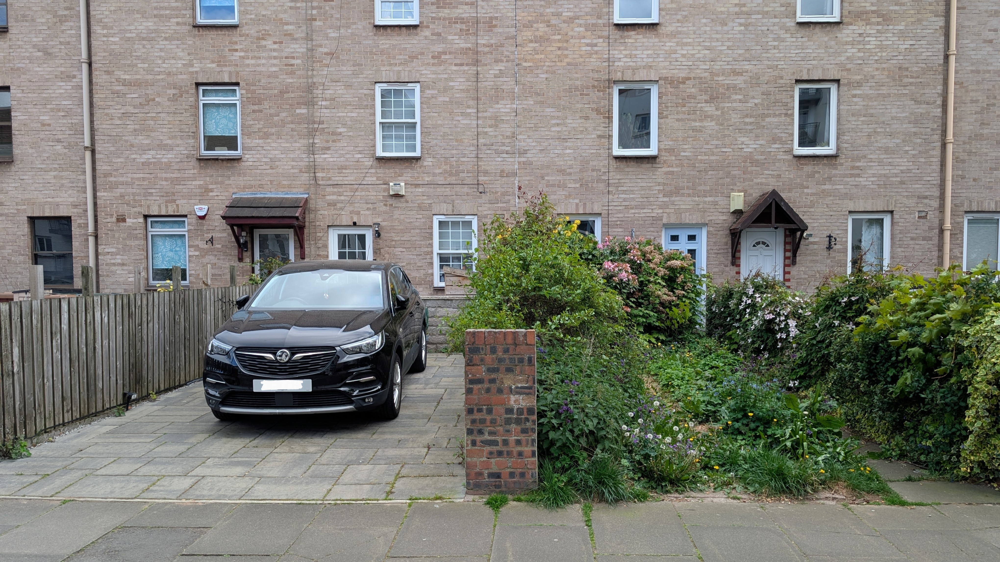

 

Photo of two front gardens. One is paved for parking and one is vegetated.
  

# About

Hello, I’m Patrick, a geographer who studies mobilities, transport, land use, and cities. I've recently submitted my PhD thesis at [the University of Edinburgh](https://www.ed.ac.uk). My research explores the repurposing of car-allocated land to improve multispecies health and wellbeing. 

Before starting PhD research, I worked in geography and urban planning in Chicago. I was a Geographic Information Science (GIS) Analyst at [IFF](https://www.iff.org), a non-profit community development organisation. Prior to that, I worked at the [Chicago Architecture Center](https://www.architecture.org), where I led this museum-like organisation’s research and communications teams.

My master’s degree is in geography from the University of Edinburgh. My undergraduate degree is in history and linguistics (with a minor in mathematics) from [Lawrence University](https://www.lawrence.edu). I studied writing at [Interlochen Arts Academy](https://www.interlochen.org) and grew up in Michigan, USA.

# Research

My PhD thesis, submitted in December 2025, is titled **From cars to commons: Repurposing car-allocated land to improve health and wellbeing in UK cities**. The thesis challenges the car-based status quo through three lines of inquiry: it describes the harm caused by the current system (see “car harm” paper below);	it identifies and measures the land allocated to cars; and it explores the potential of this land for improving health and wellbeing through the lens of the commons. 

This research draws on my training in critical geography and in both quantitative (e.g. spatial analysis, statistics) and qualitative techniques (e.g. interviews, focus groups). My PhD was funded by the Natural Environment Research Council (NERC), part of UK Research and Innovation (UKRI) and administered via the Edinburgh Earth, Ecology and Environment Doctoral Training Partnership (E4 DTP) at the University of Edinburgh. I am based in Geography in the School of GeoSciences. The supervisory team is based at the University of Edinburgh, Coventry University, and the University of Oxford.

 
<table>
 <tr>
 <td style="padding-right: 18px;">
 
 </td>
 <td>
 **Latest publication:** [Miner, Patrick, Barbara M. Smith, Anant Jani, Geraldine McNeill, and Alfred Gathorne-Hardy. 2024. **"Car Harm: A Global Review of Automobility’s Harm to People and the Environment"**. _Journal of Transport Geography_.](https://doi.org/10.1016/j.jtrangeo.2024.103817)
 </td>
 </tr>
</table>

# Contact

Please contact me through one of the options below:  

* [Bluesky](https://pdbminer.bsky.social)  
* [LinkedIn](https://www.linkedin.com/in/patrickminer)  
* [Email through University of Edinburgh](https://www.ed.ac.uk/profile/patrick-miner)  

Research profiles:  

* [ResearchGate](https://www.researchgate.net/profile/Patrick-Miner)  
* [Google Scholar](https://scholar.google.com/citations?user=LiUyty0AAAAJ)  
* [Academia](https://edinburgh.academia.edu/PatrickMiner)  
* [Scopus](https://www.scopus.com/authid/detail.uri?authorId=57472550400)  
* [ORCID](https://orcid.org/0009-0002-2925-3258)  
* [Edinburgh Research Explorer](https://www.research.ed.ac.uk/en/persons/patrick-miner)  

  
Copyright © 2021-2026 Patrick Miner.
